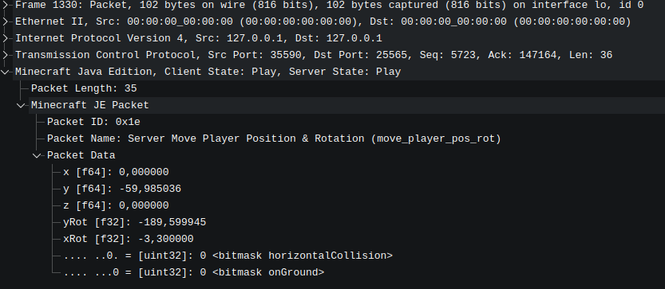

This document describes how to debug Minecraft network traffic to inspect how packets are sent.

## Prerequisites

First, **encryption and compression must be disabled**.
The compression threshold should be set to **1024**.
You can find it in this file `config/config.json5`, which will be generated after the first start.

You will need:

* A **local Minecraft server**
* **Wireshark** running with root privileges (or proper permissions) to capture traffic on `localhost`

Captured packets can be compared with the official protocol documentation:
[https://minecraft.wiki/w/Java_Edition_protocol/Packets](https://minecraft.wiki/w/Java_Edition_protocol/Packets)

This helps to understand all packet types and what they describe.

## Wireshark Setup

You can start Wireshark immediately and observe the packets, but for better readability it is recommended to compile and
use a **Wireshark dissector plugin**.

### Minecraft Wireshark Dissector

Repository:
[https://github.com/Nickid2018/MC_Dissector](https://github.com/Nickid2018/MC_Dissector)

Requirements:

* **Wireshark 4.6** (recommended)

The best recommendation is to compile the plugin yourself using the instructions in the `ci.yaml` file of the
repository.

After compilation, copy the generated `.so` file to:

```bash
~/.local/lib/wireshark/plugins/4.6/epan
```

Adjust the path according to your Wireshark version.

### Protocol Data Repository

Clone the protocol data repository:

[https://github.com/Nickid2018/MC_Protocol_Data](https://github.com/Nickid2018/MC_Protocol_Data)

## Wireshark Configuration

Start Wireshark (for loopback capture, your user must be in the `wireshark` group).

Then navigate to:

**Preferences → Protocols → MCJE**

Select the protocol and set the path to the cloned `MC_Protocol_Data` repository.
After that, **restart Wireshark**.

## Useful Display Filter

To get a better overview of Minecraft traffic, use this filter:

```wireshark
tcp.port == 25565 || udp.port == 25565
```

## Result

At the end, the packets will be **far more readable** than raw network data, making protocol debugging much easier.



## Another useful resources

These resources can you help to get a deeper understanding:

- [Decompiled Minecraft](../../../getting-started/decompile-minecraft)
- [https://minecraft.wiki/w/Java_Edition_protocol/Packets](https://minecraft.wiki/w/Java_Edition_protocol/Packets)